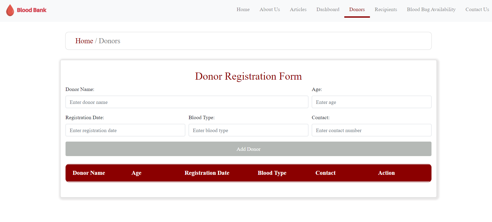

# Blood Bank Management Website

This project, created by our group using HTML, CSS, and JavaScript, aims to facilitate blood donation by connecting donors with recipients, raising awareness about the importance of blood donation, and dispelling myths surrounding the process. We developed a fully functional static website that implements CRUD functionality with a master-detail relationship and streamlined, user-friendly interfaces.

Link to the website: http://myweb.usf.edu/~senjapuri/

## Objective
- Facilitate blood donation by connecting donors with recipients.
- Raise awareness about the importance of blood donation and dispel myths.
- Develop a fully functional static website with CRUD functionality and user-friendly interfaces.

## Intent
Our website aims to create a seamless platform for blood donation, fostering connections between donors and recipients while advocating for health and community well-being.

## Goals
- **Facilitate Blood Donation:** Create a platform that makes it easy for donors and recipients to connect.
- **Raise Public Awareness:** Inform the public about the importance of blood donation and dispel common myths.
- **Optimize User Experience:** Ensure the website is intuitive and easy to navigate.
- **Promote Health Advocacy:** Advocate for blood donation as a crucial aspect of public health.
- **Foster Community Support:** Encourage community involvement and support for blood donation.
- **Provide Supportive Resources:** Offer resources and information to support blood donors and recipients.

## Website Structure
The website includes several key pages:

### Home Page
The home page serves as the introduction to our website, offering a brief overview and directing users to various sections.
- **Articles:** Clicking this link directs users to the full articles page, providing detailed information on blood donation.
- **New to Blood Donation?:** This section offers facts about blood donation myths and provides a guide for download.
- **Testimonials:** User testimonials highlighting positive experiences with blood donation.
  
*Image Description: The home page image showcases the main navigation bar, the introductory text, the articles link, and a download guide button.*

### About Us Page
The about us page provides comprehensive information about the project and the team.
- **About the Project:** Describes the website's purpose and its role in facilitating blood donation.
- **Our Team:** Includes pictures and information about the project team.
- **ERD Diagram:** Illustrates the database design and relationships.

*Image Description: The about us page image shows the project description, blood types information, team photos, and the ERD diagram.*

### Dashboard Page
The dashboard page provides an overview of key metrics and data visualizations.
- **Cards:** Display summary information such as Number of Lives Saved, Number of Donors, and Quantity of Blood.
- **Charts:**
  1. Average donor registrations monthly (bar graph).
  2. Monthly blood donations (line graph).
  3. Blood bag availability (pie chart).

*Image Description: The dashboard page image includes the summary cards and the three charts providing insights into the blood donation activities.*

### Donor Registration Form
The donor registration form allows individuals to register as blood donors.
- **Form Fields:** Includes fields for personal information, blood type, and contact details.

*Image Description: The donor registration form image shows the form fields for entering donor information.*

### Recipient Registration Form
The recipient registration form allows individuals in need of blood to register and request donations.
- **Form Fields:** Includes fields for personal information, blood type needed, and contact details.

*Image Description: The recipient registration form image shows the form fields for entering recipient information.*

### Blood Bags Available
This page provides a list of available blood bags for donation.
- **Table:** Displays details of available blood bags including blood type, quantity, and expiration date.

*Image Description: The blood bags available page image shows the table listing available blood bags and their details.*

## How to Use
1. **Navigate through the website:** Use the navigation bar to access different pages.
2. **Read Articles:** Learn about blood donation through our detailed articles.
3. **Register as a Donor or Recipient:** Fill out the respective forms to either donate blood or request a blood donation.
4. **View Dashboard:** Check the dashboard for an overview of blood donation metrics.
5. **Check Blood Availability:** Visit the blood bags available page to see available blood types and quantities.
6. **Contact Us:** Use the contact form to reach out with any questions or feedback.

## Technologies Used
- HTML
- CSS
- JavaScript

---

Feel free to reach out through our About us page - Our Team contacts if you have any questions or need further information. Together, we can make a difference in the lives of those in need of blood transfusions.
